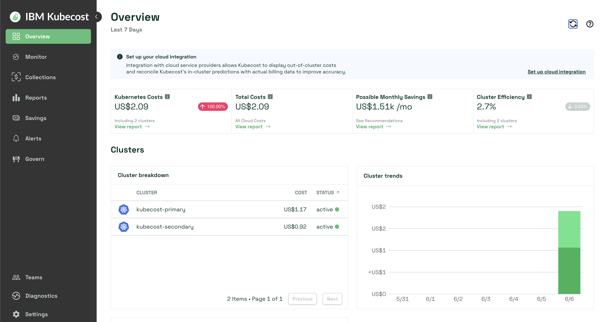
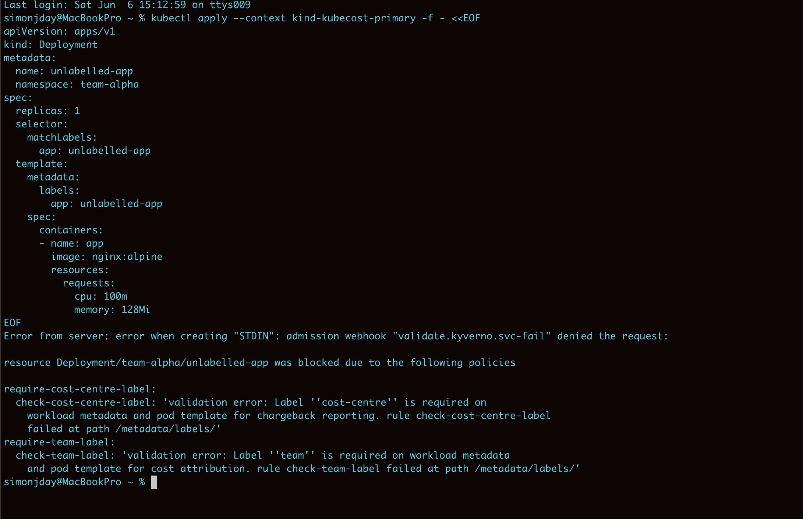
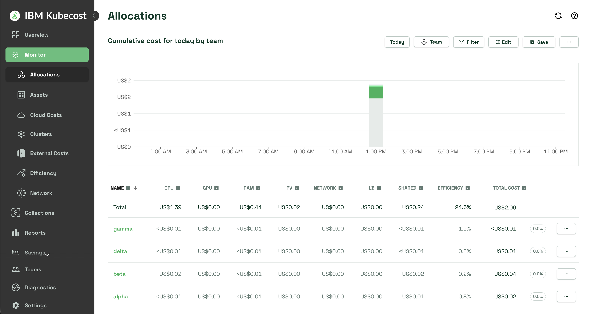
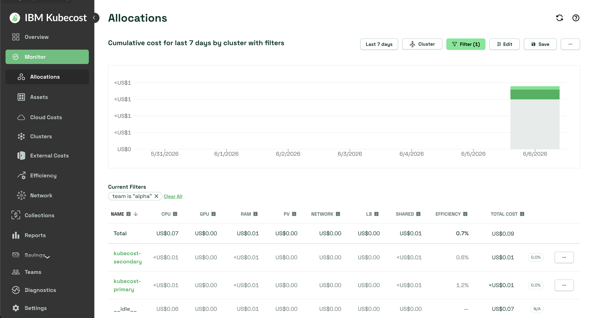
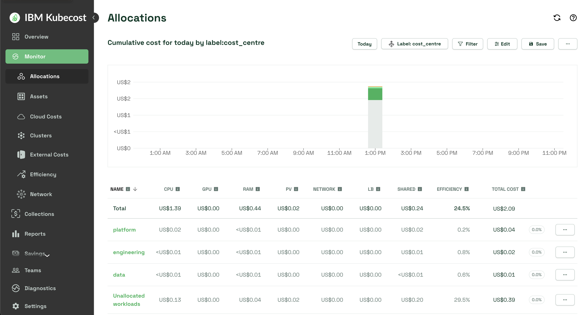

# Kubecost Multi-Cluster Cost Attribution Demo

Demonstrates unified cost visibility across two kind clusters using Kubecost
Enterprise v3, with per-team label attribution enforced by Kyverno policies on
both clusters. Both clusters are built from scratch — completely isolated from
any existing kind environments.

---

## Architecture

```
┌──────────────────────────────────────┐     ┌──────────────────────────────────────┐
│  kind-kubecost-primary  (cluster1)   │     │  kind-kubecost-secondary  (cluster2) │
│                                      │     │                                      │
│  Kubecost PRIMARY (UI + aggregator)  │     │  Kubecost AGENT (no UI)              │
│  ArgoCD                              │     │  ArgoCD                              │
│  Kyverno                             │     │  Kyverno                             │
│  kube-prometheus-stack               │     │  kube-prometheus-stack               │
│  Gitea (GitOps source for both)      │     │  (points to cluster1 Gitea)          │
│  MinIO (federated object storage)    │     │                                      │
│                                      │     │                                      │
│  Workloads:                          │     │  Workloads:                          │
│    team-alpha (shared) ──────────────┼─────┼─ team-alpha (shared)                 │
│    team-beta  (unique to c1)         │     │  team-gamma (unique to c2)           │
│                                      │     │  team-delta (unique to c2)           │
│                                      │     │                                      │
│  Kubecost Federator ◄────────────────┼─────┼─ Kubecost finops-agent               │
│       │                              │     │       │                              │
│       ▼                              │     │       ▼                              │
│  MinIO (kubecost-federated) ◄────────┼─────┼───────┘                              │
└──────────────────────────────────────┘     └──────────────────────────────────────┘
```



## Kubecost v3 federation model

Kubecost 3.x uses S3-compatible object storage (MinIO for local demo) instead
of Thanos. The `finops-agent` on each cluster pushes metrics to MinIO. The
`federator` on the primary cluster reads and combines all cluster data.

## Team / cluster matrix

| Team | Cluster 1 | Cluster 2 | Cost centre | Demo purpose |
|------|-----------|-----------|-------------|--------------|
| alpha | ✅ 2 replicas | ✅ 3 replicas | engineering | Cross-cluster — unified + per-cluster view |
| beta | ✅ 3 replicas | ❌ | platform | Unique to cluster1 |
| gamma | ❌ | ✅ 1 replica | data | Unique to cluster2 |
| delta | ❌ | ✅ 2 replicas | data | Unique to cluster2 |

## Resource profiles

| Team | Cluster | CPU request | Memory request | Replicas |
|------|---------|-------------|----------------|----------|
| alpha | kubecost-primary | 100m | 128Mi | 2 |
| alpha | kubecost-secondary | 150m | 192Mi | 3 |
| beta | kubecost-primary | 500m | 512Mi | 3 |
| gamma | kubecost-secondary | 50m | 64Mi | 1 |
| delta | kubecost-secondary | 200m | 256Mi | 2 |

---

## Repo structure

```
kubecost-multicluster-demo/
├── bootstrap/
│   ├── kind-config-cluster1.yaml   # kind cluster config — NOT synced by ArgoCD
│   └── kind-config-cluster2.yaml
├── cluster1/
│   ├── argocd/
│   │   └── application.yaml        # excluded from ArgoCD sync (self-referential)
│   ├── kubecost/
│   │   └── values-primary.yaml     # Kubecost v3 primary — UI + federator + finops-agent
│   ├── namespaces/
│   │   ├── team-alpha.yaml
│   │   └── team-beta.yaml
│   ├── policy/
│   │   ├── require-team-label.yaml
│   │   └── require-cost-centre-label.yaml
│   └── workloads/
│       ├── alpha-app.yaml          # 2 replicas, 100m/128Mi
│       └── beta-app.yaml           # 3 replicas, 500m/512Mi
├── cluster2/
│   ├── argocd/
│   │   └── application.yaml        # excluded from ArgoCD sync
│   ├── kubecost/
│   │   └── values-secondary.yaml   # Kubecost v3 agent — finops-agent only, no UI
│   ├── namespaces/
│   │   ├── team-alpha.yaml
│   │   ├── team-gamma.yaml
│   │   └── team-delta.yaml
│   ├── policy/
│   │   ├── require-team-label.yaml
│   │   └── require-cost-centre-label.yaml
│   └── workloads/
│       ├── alpha-app.yaml          # 3 replicas, 150m/192Mi
│       ├── gamma-app.yaml          # 1 replica,  50m/64Mi
│       └── delta-app.yaml          # 2 replicas, 200m/256Mi
├── shared/
│   ├── federated-store-cluster1.yaml  # MinIO secret for cluster1 (in-cluster DNS)
│   ├── federated-store-cluster2.yaml  # MinIO secret for cluster2 (Docker network IP)
│   └── policy/
│       ├── require-team-label.yaml
│       └── require-cost-centre-label.yaml
└── README.md
```

---

## Setup

### Step 1 — Create both kind clusters

```bash
kind create cluster --config bootstrap/kind-config-cluster1.yaml
kind create cluster --config bootstrap/kind-config-cluster2.yaml
```

Verify both contexts:

```bash
kubectl config get-contexts | grep kind-kubecost
```

Expected:
```
kind-kubecost-primary
kind-kubecost-secondary
```

---

### Step 2 — Install ArgoCD (both clusters)

```bash
kubectl create namespace argocd --context kind-kubecost-primary
kubectl apply -n argocd \
  -f https://raw.githubusercontent.com/argoproj/argo-cd/stable/manifests/install.yaml \
  --context kind-kubecost-primary
kubectl rollout status deployment/argocd-server -n argocd --context kind-kubecost-primary

kubectl create namespace argocd --context kind-kubecost-secondary
kubectl apply -n argocd \
  -f https://raw.githubusercontent.com/argoproj/argo-cd/stable/manifests/install.yaml \
  --context kind-kubecost-secondary
kubectl rollout status deployment/argocd-server -n argocd --context kind-kubecost-secondary
```

---

### Step 3 — Install Kyverno (both clusters)

```bash
helm repo add kyverno https://kyverno.github.io/kyverno
helm repo update kyverno

helm install kyverno kyverno/kyverno -n kyverno --create-namespace \
  --kube-context kind-kubecost-primary

helm install kyverno kyverno/kyverno -n kyverno --create-namespace \
  --kube-context kind-kubecost-secondary
```

---

### Step 4 — Install kube-prometheus-stack (both clusters)

```bash
helm repo add prometheus-community https://prometheus-community.github.io/helm-charts
helm repo update prometheus-community

helm install kube-prometheus-stack prometheus-community/kube-prometheus-stack \
  -n monitoring --create-namespace --version 85.0.1 \
  --kube-context kind-kubecost-primary

helm install kube-prometheus-stack prometheus-community/kube-prometheus-stack \
  -n monitoring --create-namespace --version 85.0.1 \
  --kube-context kind-kubecost-secondary
```

---

### Step 5 — Configure kube-state-metrics label allowlist (both clusters)

**This is a critical step.** kube-state-metrics v2+ drops all pod labels by default.
Without this, Kubecost shows all workloads as Unallocated regardless of pod labels.
Must be applied to BOTH clusters.

```bash
helm upgrade kube-prometheus-stack prometheus-community/kube-prometheus-stack \
  -n monitoring --version 85.0.1 --reuse-values \
  --set-string "kube-state-metrics.extraArgs[0]=--metric-labels-allowlist=pods=[team\,cost-centre\,environment\,app\,cluster]" \
  --kube-context kind-kubecost-primary

helm upgrade kube-prometheus-stack prometheus-community/kube-prometheus-stack \
  -n monitoring --version 85.0.1 --reuse-values \
  --set-string "kube-state-metrics.extraArgs[0]=--metric-labels-allowlist=pods=[team\,cost-centre\,environment\,app\,cluster]" \
  --kube-context kind-kubecost-secondary
```

Wait for kube-state-metrics to restart on both clusters:

```bash
kubectl rollout status deployment/kube-prometheus-stack-kube-state-metrics \
  -n monitoring --context kind-kubecost-primary

kubectl rollout status deployment/kube-prometheus-stack-kube-state-metrics \
  -n monitoring --context kind-kubecost-secondary
```

Verify labels are flowing through Prometheus on cluster1 (run after workloads are deployed in Step 15):

```bash
# Port-forward Prometheus if not already running
kubectl port-forward -n monitoring svc/prometheus-operated 9090:9090 --context kind-kubecost-primary

curl -s "http://localhost:9090/api/v1/query?query=kube_pod_labels%7Bnamespace%3D%22team-alpha%22%7D" \
  | jq '.data.result[0].metric'
```

Expected response includes `label_team`, `label_cost_centre`, `label_environment`, `label_cluster`.
If response is `null` — the allowlist is not applied. Re-run the helm upgrade above.

> **Note:** This step must be completed on both clusters before Kubecost will show
> per-team cost attribution. It is the most common cause of the Unallocated workloads
> issue. Even if Step 5 is done before workloads are deployed, verify again after
> Step 15 to confirm labels are present in Prometheus.

---

### Step 6 — Install Gitea on cluster1

```bash
helm repo add gitea-charts https://dl.gitea.io/charts
helm repo update gitea-charts

helm install gitea gitea-charts/gitea \
  -n gitea --create-namespace \
  --kube-context kind-kubecost-primary \
  --set gitea.admin.username=<GITEA_ADMIN_USER> \
  --set gitea.admin.password=<GITEA_PASSWORD> \
  --set gitea.admin.email=admin@example.com

kubectl rollout status deployment/gitea -n gitea --context kind-kubecost-primary
```

The Gitea HTTP service deploys as headless. Recreate it as NodePort so cluster2
can reach it via the kind Docker network:

```bash
kubectl delete svc gitea-http -n gitea --context kind-kubecost-primary

kubectl apply --context kind-kubecost-primary -f - <<'SVCEOF'
apiVersion: v1
kind: Service
metadata:
  name: gitea-http
  namespace: gitea
spec:
  type: NodePort
  selector:
    app.kubernetes.io/name: gitea
  ports:
  - name: http
    port: 3000
    targetPort: 3000
    nodePort: 30300
SVCEOF
```

Get cluster1 Docker network IP (needed for cluster2 ArgoCD repoURL):

```bash
CLUSTER1_IP=$(docker inspect kubecost-primary-control-plane \
  --format '{{range .NetworkSettings.Networks}}{{.IPAddress}}{{end}}')
echo "Cluster1 IP: ${CLUSTER1_IP}"
```

> `cluster2/argocd/application.yaml` is pre-set to `<CLUSTER1_DOCKER_IP>:30300`.
> If your IP differs, update that file before pushing to Gitea in Step 12.

---

### Step 7 — Install MinIO on cluster1

MinIO provides S3-compatible federated storage for Kubecost v3 multi-cluster.

```bash
helm repo add minio https://charts.min.io/
helm repo update minio

helm install minio minio/minio \
  -n minio --create-namespace \
  --set rootUser=<MINIO_PASSWORD> \
  --set rootPassword=<MINIO_PASSWORD> \
  --set mode=standalone \
  --set replicas=1 \
  --set persistence.size=10Gi \
  --set resources.requests.memory=512Mi \
  --kube-context kind-kubecost-primary
```

Expose MinIO via NodePort so cluster2 can reach it:

```bash
kubectl patch svc minio -n minio --context kind-kubecost-primary \
  --type merge -p '{"spec":{"type":"NodePort","ports":[{"port":9000,"targetPort":9000,"nodePort":30900}]}}'
```

Create the kubecost bucket:

```bash
# Install mc if not already installed
brew install minio/stable/mc

# Port-forward MinIO
MINIO_POD=$(kubectl get pod -n minio -l app=minio \
  -o jsonpath='{.items[0].metadata.name}' --context kind-kubecost-primary)
kubectl port-forward -n minio pod/${MINIO_POD} 9000:9000 --context kind-kubecost-primary &

# Create bucket
mc alias set kubecost-minio http://localhost:9000 <MINIO_PASSWORD> <MINIO_PASSWORD>
mc mb kubecost-minio/kubecost-federated
mc ls kubecost-minio
```

---

### Step 8 — Create kubecost namespace and federated-store secrets

```bash
kubectl create namespace kubecost --context kind-kubecost-primary
kubectl create namespace kubecost --context kind-kubecost-secondary

# Cluster1 — uses in-cluster MinIO DNS
kubectl apply -f shared/federated-store-cluster1.yaml --context kind-kubecost-primary

# Cluster2 — uses Docker network IP + NodePort
kubectl apply -f shared/federated-store-cluster2.yaml --context kind-kubecost-secondary
```

> If your cluster1 IP differs from `<CLUSTER1_DOCKER_IP>`, update `shared/federated-store-cluster2.yaml`
> before applying.

---

### Step 9 — Install Kubecost on cluster1 (primary)

```bash
helm repo add kubecost3 https://kubecost.github.io/kubecost/
helm repo update kubecost3

helm install kubecost kubecost3/kubecost \
  -n kubecost \
  -f cluster1/kubecost/values-primary.yaml \
  --kube-context kind-kubecost-primary

kubectl rollout status deployment/kubecost-finopsagent -n kubecost --context kind-kubecost-primary
```

---

### Step 10 — Activate Kubecost Enterprise trial

```bash
kubectl port-forward -n kubecost svc/kubecost-frontend 9003:9090 --context kind-kubecost-primary
```

1. Open `http://localhost:9003`
2. Navigate to **Settings → Start Free Trial**
3. Activates 30-day Enterprise trial — multi-cluster view enabled

> Note: Kubecost v3 UI port is 9090 (not 9002 as in v2).

---

### Step 11 — Install Kubecost on cluster2 (agent)

```bash
helm install kubecost kubecost3/kubecost \
  -n kubecost \
  -f cluster2/kubecost/values-secondary.yaml \
  --kube-context kind-kubecost-secondary

kubectl rollout status deployment/kubecost-finopsagent -n kubecost --context kind-kubecost-secondary
```

Verify cluster2 finops-agent is writing to MinIO:

```bash
kubectl logs -n kubecost deployment/kubecost-finopsagent \
  --context kind-kubecost-secondary --tail=5
```

Expected: `Successfully created bucket storage`

Verify data in bucket:

```bash
mc ls kubecost-minio/kubecost-federated/
```

Expected: `controller/`, `federated/`, `finops-agent/` directories present.

---

### Step 12 — Push repo to Gitea

```bash
# Port-forward Gitea (use a free port — Grafana may use 3000, prior port-forwards may use 3001)
GITEA_POD=$(kubectl get pod -n gitea -l app=gitea \
  -o jsonpath='{.items[0].metadata.name}' --context kind-kubecost-primary)
kubectl port-forward -n gitea pod/${GITEA_POD} 3002:3000 --context kind-kubecost-primary &

# Create repo
curl -s -X POST http://localhost:3002/api/v1/user/repos \
  -H "Content-Type: application/json" \
  -u <GITEA_ADMIN_USER>:<GITEA_PASSWORD> \
  -d '{"name":"kubecost-multicluster-demo","private":false}'

# Push
git init
git remote add origin http://<GITEA_ADMIN_USER>:<GITEA_PASSWORD>@localhost:3002/<GITEA_ADMIN_USER>/kubecost-multicluster-demo.git
git add .
git commit -m "feat: kubecost multi-cluster cost attribution demo"
git push -u origin main
```

---

### Step 13 — Apply namespaces (both clusters)

Must be done before ArgoCD sync — `CreateNamespace=false` is set in both Applications.

```bash
kubectl apply -f cluster1/namespaces/ --context kind-kubecost-primary
kubectl apply -f cluster2/namespaces/ --context kind-kubecost-secondary
```

---

### Step 14 — Apply ArgoCD Applications (both clusters)

```bash
kubectl apply -f cluster1/argocd/application.yaml --context kind-kubecost-primary
kubectl apply -f cluster2/argocd/application.yaml --context kind-kubecost-secondary
```

Check sync — if status stays `Unknown`, delete and recreate (ArgoCD deadlock on first boot):

```bash
kubectl get application kubecost-multicluster-demo-c1 -n argocd --context kind-kubecost-primary
kubectl get application kubecost-multicluster-demo-c2 -n argocd --context kind-kubecost-secondary
```

If still Unknown after 60 seconds:

```bash
kubectl delete application kubecost-multicluster-demo-c1 -n argocd --context kind-kubecost-primary
kubectl delete application kubecost-multicluster-demo-c2 -n argocd --context kind-kubecost-secondary
kubectl apply -f cluster1/argocd/application.yaml --context kind-kubecost-primary
kubectl apply -f cluster2/argocd/application.yaml --context kind-kubecost-secondary
```

Expected: `Synced` / `Healthy` on both.

---

### Step 15 — Verify workloads

```bash
kubectl get pods -n team-alpha --context kind-kubecost-primary
kubectl get pods -n team-beta --context kind-kubecost-primary
kubectl get pods -n team-alpha --context kind-kubecost-secondary
kubectl get pods -n team-gamma --context kind-kubecost-secondary
kubectl get pods -n team-delta --context kind-kubecost-secondary
```

Expected:
- cluster1: 2 alpha pods, 3 beta pods
- cluster2: 3 alpha pods, 1 gamma pod, 2 delta pods

### Step 16 — Verify labels in Prometheus and restart aggregator

Confirm labels are flowing on cluster1 Prometheus (port-forward if needed):

```bash
kubectl port-forward -n monitoring svc/prometheus-operated 9090:9090 --context kind-kubecost-primary

curl -s "http://localhost:9090/api/v1/query?query=kube_pod_labels%7Bnamespace%3D%22team-alpha%22%7D" \
  | jq '.data.result[0].metric'
```

Expected: `label_team`, `label_cost_centre`, `label_environment`, `label_cluster` all present.
If `null` — re-run Step 5 on both clusters before continuing.

Restart the Kubecost aggregator to force re-ingestion with the new label data:

```bash
kubectl rollout restart statefulset/kubecost-aggregator -n kubecost --context kind-kubecost-primary
kubectl rollout status statefulset/kubecost-aggregator -n kubecost --context kind-kubecost-primary
```

Wait ~10 minutes for the first scrape window to complete, then check the UI.

---

## Demo script

### Part 1 — Kyverno enforcement (both clusters)

```bash
kubectl apply --context kind-kubecost-primary -f - <<EOF
apiVersion: apps/v1
kind: Deployment
metadata:
  name: unlabelled-app
  namespace: team-alpha
spec:
  replicas: 1
  selector:
    matchLabels:
      app: unlabelled-app
  template:
    metadata:
      labels:
        app: unlabelled-app
    spec:
      containers:
      - name: app
        image: nginx:alpine
        resources:
          requests:
            cpu: 100m
            memory: 128Mi
EOF
```

Expected: blocked by both `require-team-label` and `require-cost-centre-label`.



Repeat with `--context kind-kubecost-secondary` to show identical enforcement.

### Part 2 — Kubecost UI multi-cluster view

1. Open `http://localhost:9003`
2. **Overview** — shows `kubecost-primary` and `kubecost-secondary` as separate cluster cards with a combined total
3. **Allocations → Aggregate by → Cluster** — per-cluster spend comparison
4. **Allocations → Aggregate by → Label → `team`** — unified team cost across all clusters:
   - `alpha` — combined cost from both clusters
   - `beta` — cluster1 only
   - `gamma` and `delta` — cluster2 only

   

5. **Cross-cluster drill-down (money shot):** From the team view, click into `alpha` → change aggregate to **Cluster** — shows `kubecost-primary` and `kubecost-secondary` as separate rows for the same team. This is the key Enterprise multi-cluster story.

   

6. **Allocations → Aggregate by → Label → `cost-centre`** — chargeback view (`engineering`, `platform`, `data`)

   

7. **Unallocated workloads** bucket — platform components (ArgoCD, Kyverno, Kubecost) without team labels. Use this to reinforce why Kyverno label enforcement matters.

### Part 3 — Kubecost API

**Verify both clusters visible:**

```bash
curl -s "http://localhost:9003/model/allocation?window=1d&aggregate=cluster&accumulate=true" \
  | jq '.data[0] | keys'
```

Expected: `kubecost-primary`, `kubecost-secondary`

**Unified cost by team (all clusters):**

```bash
curl -s "http://localhost:9003/model/allocation?window=1d&aggregate=label:team&accumulate=true" \
  | jq '.data[0] | to_entries
      | map(select(.key | startswith("_") | not))
      | map({team: .key, cpu: .value.cpuCost, ram: .value.ramCost, total: .value.totalCost})'
```

**Cost by team — cluster1 only:**

```bash
curl -s "http://localhost:9003/model/allocation?window=1d&aggregate=label:team&accumulate=true&filter=cluster%3A%22kubecost-primary%22" \
  | jq '.data[0] | to_entries | map(select(.key | startswith("_") | not)) | map({team: .key, total: .value.totalCost})'
```

**Cost by team — cluster2 only:**

```bash
curl -s "http://localhost:9003/model/allocation?window=1d&aggregate=label:team&accumulate=true&filter=cluster%3A%22kubecost-secondary%22" \
  | jq '.data[0] | to_entries | map(select(.key | startswith("_") | not)) | map({team: .key, total: .value.totalCost})'
```

**Cross-cluster alpha cost comparison:**

```bash
curl -s "http://localhost:9003/model/allocation?window=1d&aggregate=label:team,cluster&accumulate=true" \
  | jq '.data[0] | to_entries | map(select(.key | contains("alpha"))) | map({allocation: .key, total: .value.totalCost})'
```

**Cost by cost-centre (chargeback view):**

```bash
curl -s "http://localhost:9003/model/allocation?window=1d&aggregate=label:cost-centre&accumulate=true" \
  | jq '.data[0] | to_entries | map(select(.key | startswith("_") | not)) | map({cost_centre: .key, total: .value.totalCost})'
```

Expected: `engineering`, `platform`, `data`

**Alpha team split by cluster (cross-cluster money shot):**

```bash
curl -s "http://localhost:9003/model/allocation?window=1d&aggregate=cluster&accumulate=true&filter=label%5Bteam%5D%3A%22alpha%22" \
  | jq '.data[0] | to_entries | map(select(.key | startswith("_") | not)) | map({cluster: .key, total: .value.totalCost})'
```

Expected:
```json
[
  { "cluster": "kubecost-primary",   "total": 0.00111 },
  { "cluster": "kubecost-secondary", "total": 0.00083 }
]
```

**Hourly breakdown per team:**

```bash
curl -s "http://localhost:9003/model/allocation?window=1d&aggregate=label:team&accumulate=false" \
  | jq '[.data[] | select(. != null) | to_entries | map(select(.key | startswith("_") | not)) | map({team: .key, total: .value.totalCost})] | flatten'
```

---

## Known behaviours & fixes encountered

| Issue | Cause | Fix |
|-------|-------|-----|
| `clusterId is required` on install | Kubecost 2.9 migration chart | Use v3 chart: `helm repo add kubecost3 https://kubecost.github.io/kubecost/` |
| `kubecostFrontend` not supported | v3 renamed to `frontend` | Use `frontend.enabled: false` |
| `kubecostProductConfigs.clusterName` not supported | v3 uses `global.clusterId` only | Remove `clusterName`, use `global.clusterId` |
| `federatedETL.federatedCluster` not supported | v3 uses `finopsagent.enabled` | Use `finopsagent.enabled: true` |
| Thanos federation not applicable | v3 uses S3/MinIO not Thanos | Deploy MinIO, use `global.federatedStorage` |
| finops-agent CrashLoopBackOff on cluster2 | MinIO not reachable at ClusterIP | Expose MinIO via NodePort 30900, update secret |
| Gitea HTTP service headless | Helm chart default | Delete and recreate as NodePort 30300 |
| ArgoCD sync Unknown deadlock | First-boot race condition | Delete and recreate the Application |
| kind-config.yaml causes OutOfSync | ArgoCD tries to apply it as K8s resource | Moved to `bootstrap/` — outside ArgoCD sync path |
| ArgoCD Application self-referential OutOfSync | Application manages itself | Added `exclude: 'argocd/**'` to directory config |
| Kyverno ClusterPolicies OutOfSync | Kyverno mutates `.spec`/`.status`/`.metadata.annotations` | `ignoreDifferences` covers all three paths |
| All workloads Unallocated in Kubecost | kube-state-metrics v2+ drops all pod labels by default | **Step 5** — apply helm upgrade with `--metric-labels-allowlist` on BOTH clusters, verify with Prometheus query, restart aggregator (Step 16) |
| Cost values `<US$1` | kind nodes have no cloud `instance_type` label | Expected; `defaultModelPricing` set in both values files |
| Multi-cluster view not visible | Enterprise trial not activated | Settings → Start Free Trial |
